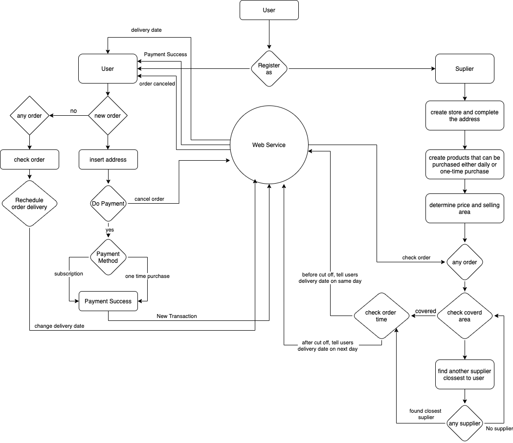

## basic concept
1. Coding
  - i'll give one example that i found everyday in my office, same function in many class. This will get serious problem if the fresh programmer join the team. He will confuse what function he should get and from what class. 
   - the mitigation of this problem just simple. discust with other member that they alredy made that function in that class so only use that for your need. No more smell code. 
  - Dependency Injection is design patter that very useful for loosely coupled, highly modularity which dependen for each class is less.
  
2. Rest API
   - POST 
    : for new person work on API , sometime the not relize the responde code is much, but they only return 200 for every thing.
      - do : speficy the return code, 200, 201 and so on
      - dont : 200 for all 
   - GET : dont return all data once they request. use paging or you can spesify the data return cause it will effect on server load and requester side too much data return.
     - do : specify the return 
     - dont : floor all the data

## Basic Coding

## Algorithm
1. [algorithm-1.go](algorithm-1.go).
2. [algorithm-2.go](algorithm-2.go).
3. [algorithm-3.go](algorithm-3.go).
4. [algorithm-4.go](algorithm-4.go).
